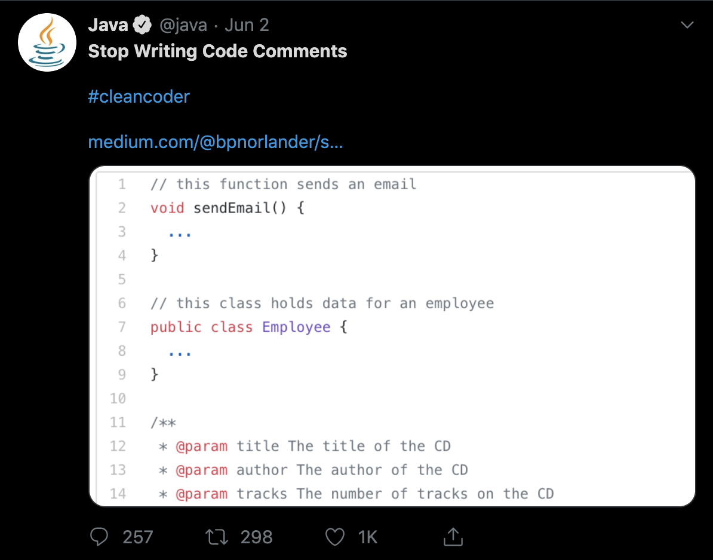
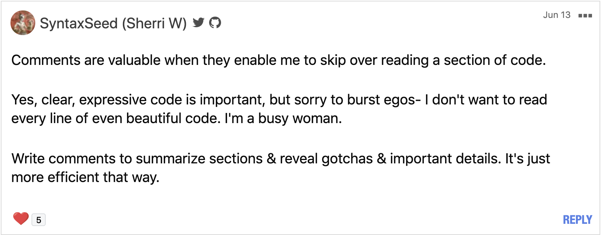
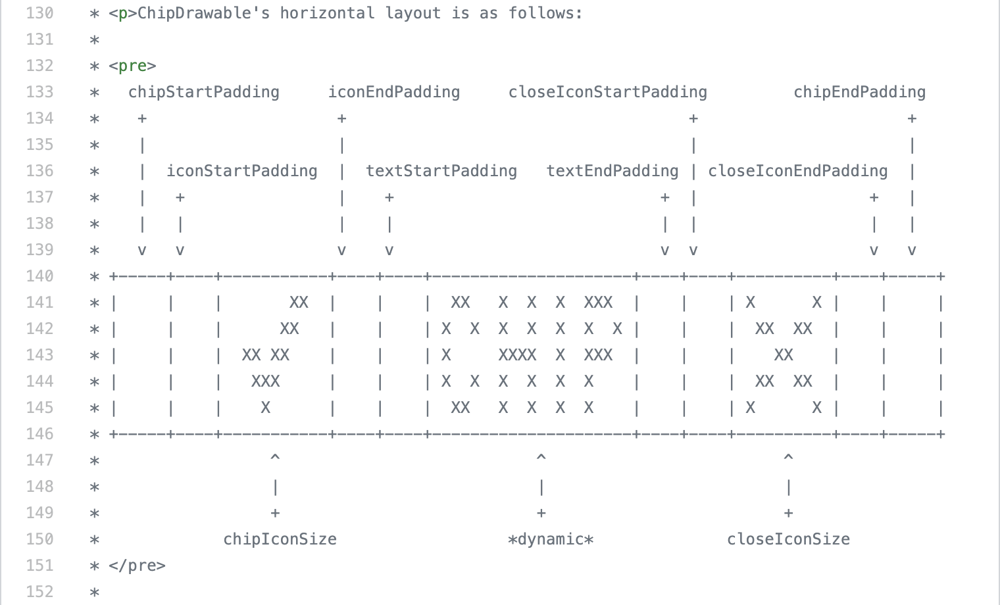

slidenumbers: true
autoscale: true
footer: @AdamMc331<br/>#DCNYC19
build-lists: true

# //TODO: Write A Better Comment
## Adam McNeilly - @AdamMc331

---



---

# This Is Bad Advice

---

# It Also Doesn't Need To Be This Harsh

> "When you need to write a comment, it usually means that you have failed to write code that was expressive enough. You should feel a sharp pain in your stomach every time you write a comment."

---

# You Are Not A Failure For Writing Comments

---

# We Need To Stop Writing _Bad_ Comments

---

# Why Do We Have Comments, Anyways?

---

# They Provide Additional Insight

```kotlin
/**
 * There is certain functionality that we need to be consistent 
 * in all WebViews of our app.
 * For some URLs, though, we need additional customization so we 
 * can extend this base class accordingly.
 */
class BaseWebViewClient(...) : WebViewClient
```

---

# They Can Tell You Why The Programmer Did Something

```kotlin
// The API returns the time in seconds
// but we need to manipulate it as milliseconds.
val timeInMillis = response.time * 1000
```

---

# They Can Provide Documentation

```kotlin
interface AccountDAO {
    /**
     * Inserts an account into the database.
     *
     * @param[account] The account that we're inserting.
     * @return The ID of the inserted account.
     */
    fun insert(account: Account): Long
}
```

---

# What Risks Do Comments Pose?

---

# Changing Code Doesn't Guarantee We Change Comments

---

# Describe Some Action

```kotlin
// We only want active users
val usersToDisplay = userList.filter { user ->
	user.isActive
}
```

---

# Some Time Later

---

# That Action Changed

```kotlin
// We only want active users
val usersToDisplay = userList.filter { user ->
	user.isActive && user.completedRegistration
}
```

---

# Some Time Later

---

# Who is right? 🤔

```kotlin
// We only want active users
val usersToDisplay = userList.filter { user ->
	user.isActive && user.completedRegistration
}
```

---

# Managing Code And Comments Is Difficult

- Try to avoid them by default
- Don't avoid comments just for avoidance sake
- Ask yourself if there's some way to avoid it

---

# Avoid Redundant Comments

---

# The Comments Tell Me Everything The Code Does

```kotlin
interface AccountDAO {
    /**
     * Inserts an account into the database.
     *
     * @param[account] The account that we're inserting.
     * @return The ID of the inserted account.
     */
    fun insert(account: Account): Long
}
```

---

# Remove What We Don't Need

```kotlin
interface AccountDAO {
    /**
     * @return The ID of the inserted account.
     */
    fun insert(account: Account): Long
}
```

---

# An Exception

- If you're writing a library or public facing API, document everything
- More on this later

---

# Change Code To Avoid Needing Comments

---

# Sometimes We Try To Clarify Behavior

```kotlin
// Saves data to database
fun saveData() {
	// ...
}
```

---

# We Can Write More Expressive Method Names

```kotlin
fun saveDataToDatabase() {
	// ...
}
```

---

# Sometimes We Use Them To Break Up A Method[^1]

```kotlin
fun transferMoney(fromAccount: Account, toAccount: Account, amount: Double) {
   // create withdrawal transaction and remove from fromAccount
   // ...

   // create deposit transaction and add from toAccount
   // ...
}
```

[^1]: This is also bad because methods should do just one thing.

---

# We Should View This As An Opportunity To Extract Functionality

```kotlin
fun transferMoney(fromAccount: Account, toAccount: Account, amount: Double) {
   withdrawMoney(fromAccount, amount)
   depositMoney(toAccount, amount)
}
```

---

# Now What?

- We removed any redundant comments
- We changed code to avoid comments
- But we still feel the need to clarify what we did, or we're working on a public API

---

# How Do I Ensure The Comments I Do Write Are Helpful?

---

# Comments Tell You _Why_, Code Tells You _What_

---

# This Comment Only Tells Me What

```kotlin
/**
 * A list of updated questions to be replaced in our list by an interceptor.
 */
private val updatedQuestions: MutableMap<Long, Question> = HashMap()
```

---

# We Should Clarify Why We Need This Value

```kotlin
/**
 * The `PagedList` class from Android is backed by an immutable list. 
 * However, if the user answers a question locally, we want to update the display 
 * without having to fetch the data from the network again.
 * 
 * To do that, we keep this local cache of questions that the user has 
 * answered during this app session, and later when we are building 
 * the list we can override questions with one from this list, if it exists.
 * That's determined by the key of this HashMap, which is the question ID.
 */
private val updatedQuestions: MutableMap<Long, Question> = HashMap()
```

---

# Comments With Examples Are Helpful

---

# These Are All Redundant

```kotlin
class Pokedex {
    /**
     * Adds a pokemon to this pokedex.
     * 
     * @param[name] The name of the Pokemon.
     * @param[number] The number of the Pokemon.
     */
    fun addPokemon(name: String, number: Int) {

    }
}
```

---

# We Can Provide Examples

```kotlin
class Pokedex {
    /**
     * Adds a pokemon to this Pokedex.
     * 
     * @param[name] The name of the Pokemon (Bulbasaur, Ivysaur, Venusaur).
     * @param[number] The number of the Pokemon (001, 002, 003).
     */
    fun addPokemon(name: String, number: Int) {

    }
}
```

---

# Links To External Resources Are Helpful

---

# For Things We Find On StackOverflow

```kotlin
/**
 * A ViewPager that cannot be swiped by the user, 
 * but only controlled programatically.
 *
 * Inspiration: https://stackoverflow.com/a/9650884/3131147
 */
class NonSwipeableViewPager(
	context: Context, 
	attrs: AttributeSet? = null
) : ViewPager(context, attrs) {
	// ...
}
```

---

# For Internal Documentation

```kotlin
/**
 * Implementation of some feature that I was asked to build.
 *
 * Design/Product Spec: https://confluence.com/some/feature
 */
class SomeFeatureFragment : Fragment() {
	// ...
}
```

---

# For Work Arounds Of Reported Issues

```kotlin
/**
 * The carousel library we use does not support a
 * specific functionality that we need. We've extended
 * this class to modify it ourselves.
 *
 * Issue reported: https://github.com/library/issues/1
 */ 
class MyCustomCarousel : Carousel() {
	// ...
}
```

---

# Actionable Comments Are Helpful

---

# //TODO: Comments

---

# Two Options For //TODO: Comments

---

# Option 1: Just Do It

---

# Option 2: Link To External Issue Tracker

```kotlin
//TODO: Consolidate both of these classes
// since we only have one activity now.
// AAA-123
class MainActivity : BaseActivity() {
	// ...
}
```

---

# Deprecation Comments Can Be Actionable

---

# Don't Do This

```kotlin
@Deprecated
public interface DefaultBehavior {
    // ...
}
```

---

# Tell People What The Replacement Is

```kotlin
/**
 * @deprecated Use {@link AttachedBehavior} instead
 */
@Deprecated
public interface DefaultBehavior {
    // ...
}
```

---

# Other General Suggestions

---

# Try To Summarize Large Sections Of Code



---

# ASCII Art?[^2]




[^2]: https://github.com/material-components/material-components-android/blob/master/lib/java/com/google/android/material/chip/ChipDrawable.java#L130-L151

---

# Reference Classes/Methods/Properties

- Helps survive refactoring of a field
- IDE may let you click into a reference

---

# Without References

[.code-highlight: 2, 4]
```kotlin
/**
 * Retrieves the primary Type for a Pokemon.
 */
val firstType: Type?
    get() = currentState.pokemon?.sortedTypes?.firstOrNull()
```

Refactor class name...

[.code-highlight: 2, 4]
```kotlin
/**
 * Retrieves the primary Type for a Pokemon.
 */
val firstType: PokemonType?
    get() = currentState.pokemon?.sortedTypes?.firstOrNull()
```

---

# With References

[.code-highlight: 2, 4]
```kotlin
/**
 * Retrieves the primary [Type] for a [Pokemon].
 */
val firstType: Type?
    get() = currentState.pokemon?.sortedTypes?.firstOrNull()
```

Refactor class name...

[.code-highlight: 2, 4]
```kotlin
/**
 * Retrieves the primary [PokemonType] for a [Pokemon].
 */
val firstType: PokemonType?
    get() = currentState.pokemon?.sortedTypes?.firstOrNull()
```

---

# Be Consistent With Your Language

- When documenting methods that return booleans, try to always describe the true condition
- Don't describe the true response for some methods and the false response for others

---

# Recap

- Avoid redundant comments
- Try to refactor your code to avoid a comment
- If you have to write a comment, try your best to be helpful
 - Explain _why_
 - Provide examples
 - Be actionable
 - Leverage IDE tools
 - Be consistent

---

# Thank You!

## https://github.com/AdamMc331/TODO-DCNYC19